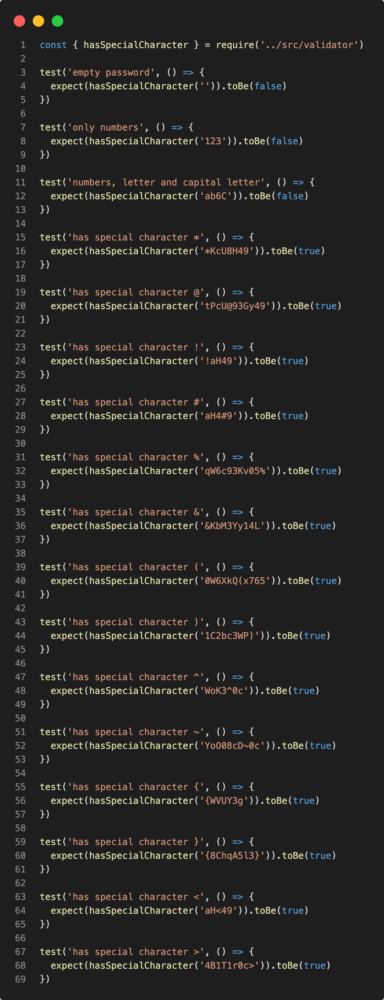

# Password Validator

Simple password validator made with Javascript 💛

## Branch history

- `base-code`: a complex logic to password validator. In next branches, we'll add tests and refactor the code
- `refactor-1`: refactoring the `minSize` function to `hasMinLength` and creating unit tests
- `refactor-2`: refactoring the `checkNumbers` function to `hasNumbers` and creating unit tests
- `refactor-3`: refactoring the `checkCapitalize` function to `hasCapitalLetter` and creating unit tests
- `refactor-4`: refactoring the `checkSpecialChars` function to `hasSpecialCharacter` and creating unit tests

### hasSpecialCharacter

I developed a unit test for each special character, like this:

  

## Stack

- node `12.22.12`
- npm `6.7.0`
- jest `28.1.1`

## 👩 Author

| [ <b>@laisfrigerio</b>](https://github.com/laisfrigerio)  |
| :---: |

## 📄 License

This project is licensed under the MIT License - see the LICENSE.md file for details